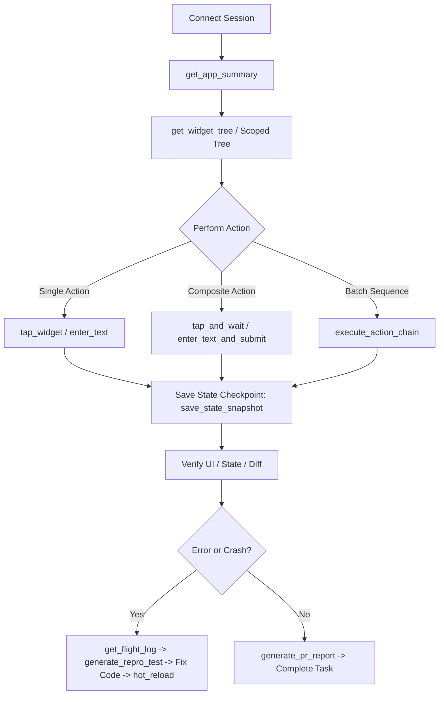

# FlutterPilot Agent Skill

This skill guides AI coding agents (Antigravity, Claude, Cursor, Copilot, Cline, Windsurf, Devin) on orchestrating FlutterPilot MCP tools to inspect, test, debug, and develop Flutter applications autonomously with zero friction and minimal token overhead.

## When to Use
- **Autonomous UI Driving**: Filling forms, tapping buttons, and navigating complex user journeys without requiring manual `ValueKey`s.
- **High-Speed Composite Macros**: Using `tap_and_wait` and `enter_text_and_submit` to execute multi-step user actions in 1 fast LLM turn.
- **Subtree Scoping & Token Savings**: Using `get_widget_tree(rootKey: "form_id")` to inspect specific dialogs or forms with 90% fewer tokens.
- **Time-Travel State Snapshots**: Instant point-in-time state checkpointing and restoration (`save_state_snapshot`, `restore_state_snapshot`, `batch_set_state`).
- **Autonomous Crash Flight Recording**: Automatically retrieving rolling 30s crash timelines (`get_flight_log`) and synthesizing executable `repro_test.dart` reproduction tests.
- **Autonomous Chaos & Stress Fuzzing**: Simulating aggressive monkey testing (`run_chaos_fuzzing`) to discover edge cases and unhandled exceptions.
- **Memory & Asset Health Audits**: Checking for image memory bloat, uncompressed asset leaks, and oversize decodes (`audit_memory_health`).
- **Production Test Suite Synthesis**: Exporting full Patrol, Integration, and Widget test suites (`export_test_suite`).
- **Visual Regression Engine**: Word-aligned 32-bit pixel diff detection with magenta highlighting (`compare_screenshot`).
- **Automated Pull Request Reports**: Generating structured markdown PR descriptions with reproduction steps, test coverage, and screenshots (`generate_pr_report`).

---

## Step-by-Step Autonomous Workflow



---

## Tool Cheat Sheet for AI Agents

### 1. Fast UI Reconnaissance (Minimal Tokens)
```json
// Inspect full compacted widget hierarchy (75-85% token reduction)
call_tool("get_widget_tree", {"compact": true})

// Scope inspection to only an active dialog, form, or bottom sheet (90% extra savings)
call_tool("get_widget_tree", {"rootKey": "login_form", "compact": true})

// Quick visual screenshot
call_tool("capture_screenshot", {})
```

### 2. High-Speed UI Driving & Composite Macros
```json
// 1-Turn Macro: Tap button and wait until next screen/widget appears
call_tool("tap_and_wait", {
  "target": "Button['Log In']",
  "expect": "home_dashboard",
  "timeout": 5000
})

// 1-Turn Macro: Enter text into input and immediately submit
call_tool("enter_text_and_submit", {
  "target": "TextField['Email']",
  "text": "alice@example.com",
  "submitTarget": "Button['Continue']"
})

// High-speed native action batch (executes inside Flutter engine in 2ms)
call_tool("execute_action_chain", {
  "actions": [
    {"action": "enterText", "target": "TextField['Username']", "text": "alice"},
    {"action": "enterText", "target": "TextField['Password']", "text": "secret123"},
    {"action": "tap", "target": "Button['Sign In']"}
  ]
})
```

### 3. State Management & Atomic Seeding
```json
// Atomic multi-variable state update in 1ms pass (Riverpod / Bloc)
call_tool("batch_set_state", {
  "type": "riverpod",
  "states": {
    "themeProvider": "dark",
    "isLoggedIn": true,
    "userProfile": {"name": "Alice", "role": "admin"}
  }
})

// Time-Travel: Save state checkpoint before risky action
call_tool("save_state_snapshot", {"name": "pre_checkout"})

// Time-Travel: Rewind state in <100ms
call_tool("restore_state_snapshot", {"name": "pre_checkout"})
```

### 4. Continuous Diagnostics, Memory Health & Chaos Fuzzing
```json
// Audit memory health (ImageCache, decode dimensions, oversize assets)
call_tool("audit_memory_health", {})

// Run autonomous chaos monkey testing (random taps, text entries, back navigations)
call_tool("run_chaos_fuzzing", {
  "iterations": 25,
  "intensity": "high",
  "injectNetworkErrors": true
})

// Inspect deduplicated recent errors
call_tool("get_errors", {})

// Retrieve 30s rolling flight timeline
call_tool("get_flight_log", {})
```

### 5. Automated Test Generation & PR Reports
```json
// Synthesize standalone executable reproduction test to disk
call_tool("generate_repro_test", {
  "testName": "Reproduce checkout payment failure",
  "writeToDisk": true
})

// Export production-ready Patrol or Integration test suite
call_tool("export_test_suite", {
  "framework": "patrol",
  "testName": "User Onboarding Flow",
  "filePath": "integration_test/onboarding_flow_test.dart"
})

// Generate formatted GitHub PR markdown description
call_tool("generate_pr_report", {
  "title": "Fix authentication race condition in token refresh",
  "includeRepro": true,
  "includeChecklist": true
})
```
