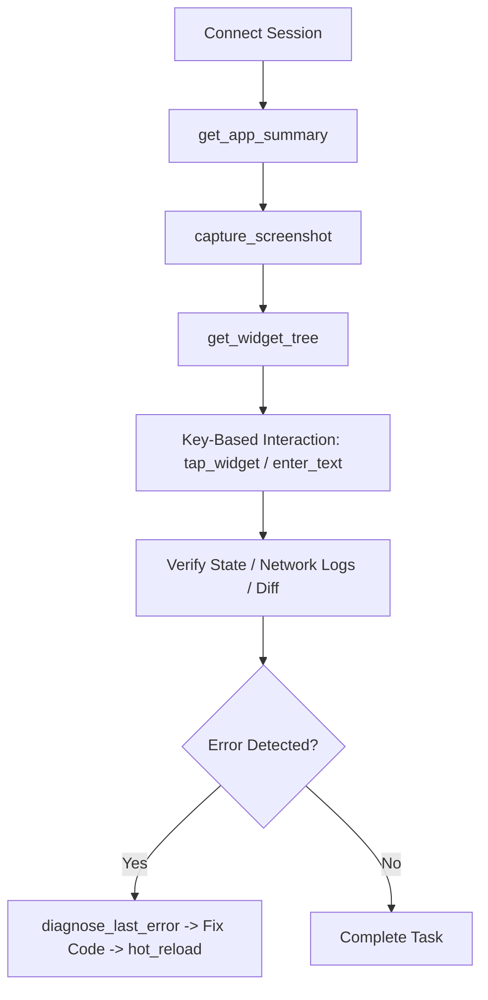

# FlutterPilot Agent Skill

This skill guides AI agents on orchestrating FlutterPilot MCP tools to test, debug, and develop Flutter applications autonomously.

## When to Use
- Autonomous UI verification (filling forms, clicking buttons, testing user journeys).
- Visual regression testing with pixel diff detection.
- Debugging state management (Riverpod, Bloc), network calls (Dio), databases (Drift, SQLite), or local storage (Hive, SharedPreferences, SecureStorage).
- Simulating network chaos (offline mode, slow 3G latency, synthetic 500 error mocks).
- Multi-device fleet testing across iOS, Android, and Web.
- Catching unhandled runtime exceptions and auto-applying hot reloads.

## Step-by-Step Autonomous Workflow



### 1. Initial State Reconnaissance
```json
// 1. Get summary
call_tool("get_app_summary", {})

// 2. See visual UI
call_tool("capture_screenshot", {})

// 3. Inspect widget hierarchy and keys (PII automatically masked)
call_tool("get_widget_tree", {"maxDepth": 50})
```

### 2. Deterministic UI Driving
Always look up the widget's `key` from the widget tree:
```json
// Fill input field
call_tool("enter_text", {"key": "email_field", "text": "user@example.com"})

// Scroll if off-screen
call_tool("scroll_into_view", {"key": "submit_button"})

// Tap button (triggers live AI visual pointer on app screen)
call_tool("tap_widget", {"key": "submit_button"})

// Advance frames
call_tool("pump_frames", {"count": 10})
```

### 3. Visual Regression Diff Engine
```json
// 1. Establish golden baseline
call_tool("save_screenshot_baseline", {"name": "checkout_screen"})

// 2. After making modifications, compare:
call_tool("compare_screenshot", {"name": "checkout_screen", "threshold": 0.5})
```

### 4. Network Chaos & Mocking
```json
// Mock endpoint with synthetic 500 error
call_tool("mock_http_response", {
  "urlPattern": "/api/v1/payment",
  "statusCode": 500,
  "body": "{\"error\": \"Payment processor unavailable\"}",
  "delayMs": 1000
})

// Simulate slow 3G or offline
call_tool("simulate_network", {"condition": "slow_3g"})
call_tool("simulate_offline", {"enabled": "true"})
```

### 5. Multi-Device Fleet Manager
```json
// List connected iOS/Android/Web instances
call_tool("list_connected_devices", {})

// Switch target device
call_tool("switch_device", {"id": "android_emu"})
```

### 6. Self-Healing Crashes
```json
// Analyze failure
call_tool("diagnose_last_error", {})

// After editing Dart file in workspace, hot reload:
call_tool("hot_reload", {})
```
