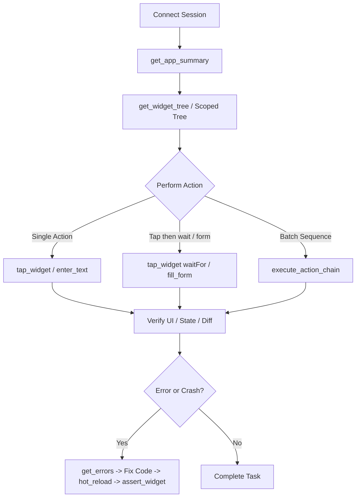

# FlutterPilot Agent Skill

This skill guides AI coding agents (Antigravity, Claude, Cursor, Copilot, Cline, Windsurf, Devin) on orchestrating FlutterPilot MCP tools to inspect, test, debug, and develop Flutter applications autonomously with zero friction and minimal token overhead.

## When to Use
- **Autonomous UI Driving**: Filling forms, tapping buttons, and navigating complex user journeys without requiring manual `ValueKey`s.
- **One call instead of several**: `tap_widget(waitFor: ...)`, `fill_form(submitWith: ...)` and `execute_action_chain` run multi-step actions in one turn.
- **Subtree scoping**: `get_widget_tree(rootKey: "form_id")` returns only one dialog or form.
- **State Injection**: Seeding Riverpod/Bloc state directly (`set_state`).
- **Crash Reports**: the exception, the failing source location, route and recent requests (`get_errors(report: true)`).
- **Memory & Allocation Inspections**: Checking heap capacity, used bytes, and top Dart classes (`get_memory_details`, `classes: true`).
- **Visual regression**: `compare_screenshot(name, save: true)`, then `compare_screenshot(name)` — changed % and a diff image with changes in magenta.

---

## Step-by-Step Autonomous Workflow


```mermaid
flowchart TD
    A[Connect Session] --> B[get_app_summary]
    B --> C[get_widget_tree / Scoped Tree]
    C --> D{Perform Action}
    D -->|Single Action| E[tap_widget / enter_text]
    D -->|Tap then wait / form| F[tap_widget waitFor / fill_form]
    D -->|Batch Sequence| G[execute_action_chain]
    E & F & G --> I[Verify UI / State / Diff]
    I --> J{Error or Crash?}
    J -- Yes --> K[get_errors -> Fix Code -> hot_reload -> assert_widget]
    J -- No --> L[Complete Task]
```

---

## Tool Cheat Sheet for AI Agents

### 1. Fast UI Reconnaissance (Minimal Tokens)
```json
// The app's own widgets, layout wrappers pruned
call_tool("get_widget_tree", {"compact": true})

// Only one dialog, form, or bottom sheet
call_tool("get_widget_tree", {"rootKey": "login_form", "compact": true})

// Quick visual screenshot
call_tool("capture_screenshot", {})
```

### 2. High-Speed UI Driving & Composite Macros
```json
// Tap, then wait until the next screen's widget appears
call_tool("tap_widget", {
  "key": "Button['Log In']",
  "waitFor": "home_dashboard",
  "timeoutMs": 5000
})

// Fill fields and submit in one call
call_tool("fill_form", {
  "fields": {"TextField['Email']": "alice@example.com"},
  "submitWith": "Button['Continue']"
})

// A known sequence of steps in one call, with a check at the end
call_tool("execute_action_chain", {
  "steps": [
    {"tool": "enter_text", "arguments": {"key": "TextField['Username']", "text": "alice"}},
    {"tool": "enter_text", "arguments": {"key": "TextField['Password']", "text": "secret123"}},
    {"tool": "tap_widget", "arguments": {"key": "Button['Sign In']"}},
    {"tool": "wait_for", "arguments": {"route": "/home"}}
  ]
})
```

### 3. State Management & Atomic Seeding
```json
// Several Riverpod / Bloc states at once (names from get_state)
call_tool("set_state", {
  "states": {
    "themeProvider": "dark",
    "isLoggedIn": true,
    "userProfile": {"name": "Alice", "role": "admin"}
  }
})

```

### 4. Continuous Diagnostics & Performance
```json
// Inspect memory details (heap used, capacity, external memory)
call_tool("get_memory_details", {})

// Frame timing: p50/p90/p99, build vs raster, jank
call_tool("profile_frame_budget", {})

// DevTools Network tab: status, timing, sizes for any HTTP client
call_tool("get_http_profile", {"limit": 20})

// Inspect deduplicated recent errors
call_tool("get_errors", {})
```

