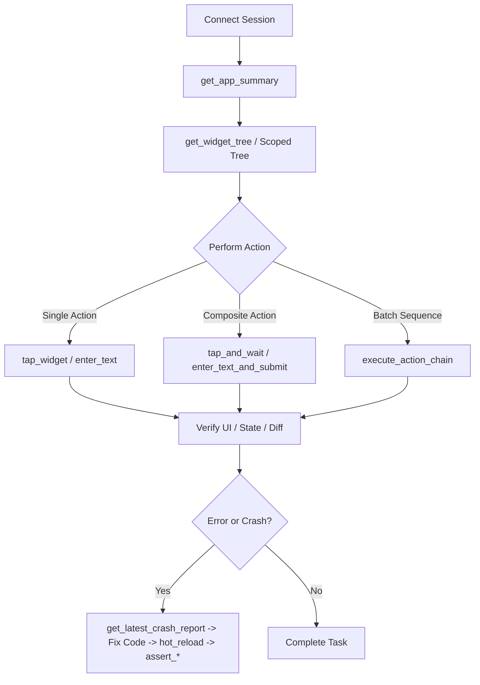

# FlutterPilot Agent Skill

This skill guides AI coding agents (Antigravity, Claude, Cursor, Copilot, Cline, Windsurf, Devin) on orchestrating FlutterPilot MCP tools to inspect, test, debug, and develop Flutter applications autonomously with zero friction and minimal token overhead.

## When to Use
- **Autonomous UI Driving**: Filling forms, tapping buttons, and navigating complex user journeys without requiring manual `ValueKey`s.
- **High-Speed Composite Macros**: Using `tap_and_wait` and `enter_text_and_submit` to execute multi-step user actions in 1 fast LLM turn.
- **Subtree Scoping & Token Savings**: Using `get_widget_tree(rootKey: "form_id")` to inspect specific dialogs or forms with 90% fewer tokens.
- **State Injection**: Seeding Riverpod/Bloc state directly (`set_riverpod_state`, `batch_set_state`).
- **Crash Flight Recording**: Rolling crash timelines (`get_flight_log`) and crash reports with the failing source location (`get_latest_crash_report`).
- **Memory & Allocation Inspections**: Checking heap capacity, used bytes, and top Dart classes (`get_memory_details`, `get_allocation_profile`).
- **Visual Regression Engine**: Word-aligned 32-bit pixel diff detection with magenta highlighting (`compare_screenshot`).

---

## Step-by-Step Autonomous Workflow


```mermaid
flowchart TD
    A[Connect Session] --> B[get_app_summary]
    B --> C[get_widget_tree / Scoped Tree]
    C --> D{Perform Action}
    D -->|Single Action| E[tap_widget / enter_text]
    D -->|Composite Action| F[tap_and_wait / enter_text_and_submit]
    D -->|Batch Sequence| G[execute_action_chain]
    E & F & G --> I[Verify UI / State / Diff]
    I --> J{Error or Crash?}
    J -- Yes --> K[get_latest_crash_report -> Fix Code -> hot_reload -> assert_*]
    J -- No --> L[Complete Task]
```

---

## Tool Cheat Sheet for AI Agents

### 1. Fast UI Reconnaissance (Minimal Tokens)
```json
// Inspect full compacted widget hierarchy (75-85% token reduction)
call_tool("get_widget_tree", {"compact": true})

// Scope inspection to only an active dialog, form, or bottom sheet (90% extra savings)
call_tool("get_widget_tree", {"rootKey": "login_form", "compact": true})

// Quick visual screenshot
call_tool("capture_screenshot", {})
```

### 2. High-Speed UI Driving & Composite Macros
```json
// 1-Turn Macro: Tap button and wait until next screen/widget appears
call_tool("tap_and_wait", {
  "target": "Button['Log In']",
  "expect": "home_dashboard",
  "timeout": 5000
})

// 1-Turn Macro: Enter text into input and immediately submit
call_tool("enter_text_and_submit", {
  "target": "TextField['Email']",
  "text": "alice@example.com",
  "submitTarget": "Button['Continue']"
})

// High-speed native action batch (executes inside Flutter engine in 2ms)
call_tool("execute_action_chain", {
  "actions": [
    {"action": "enterText", "target": "TextField['Username']", "text": "alice"},
    {"action": "enterText", "target": "TextField['Password']", "text": "secret123"},
    {"action": "tap", "target": "Button['Sign In']"}
  ]
})
```

### 3. State Management & Atomic Seeding
```json
// Atomic multi-variable state update in 1ms pass (Riverpod / Bloc)
call_tool("batch_set_state", {
  "type": "riverpod",
  "states": {
    "themeProvider": "dark",
    "isLoggedIn": true,
    "userProfile": {"name": "Alice", "role": "admin"}
  }
})

```

### 4. Continuous Diagnostics & Performance
```json
// Inspect memory details (heap used, capacity, external memory)
call_tool("get_memory_details", {})

// Frame timing: p50/p90/p99, build vs raster, jank
call_tool("profile_frame_budget", {})

// DevTools Network tab: status, timing, sizes for any HTTP client
call_tool("get_http_profile", {"limit": 20})

// Inspect deduplicated recent errors
call_tool("get_errors", {})

// Retrieve 30s rolling flight timeline
call_tool("get_flight_log", {})
```

